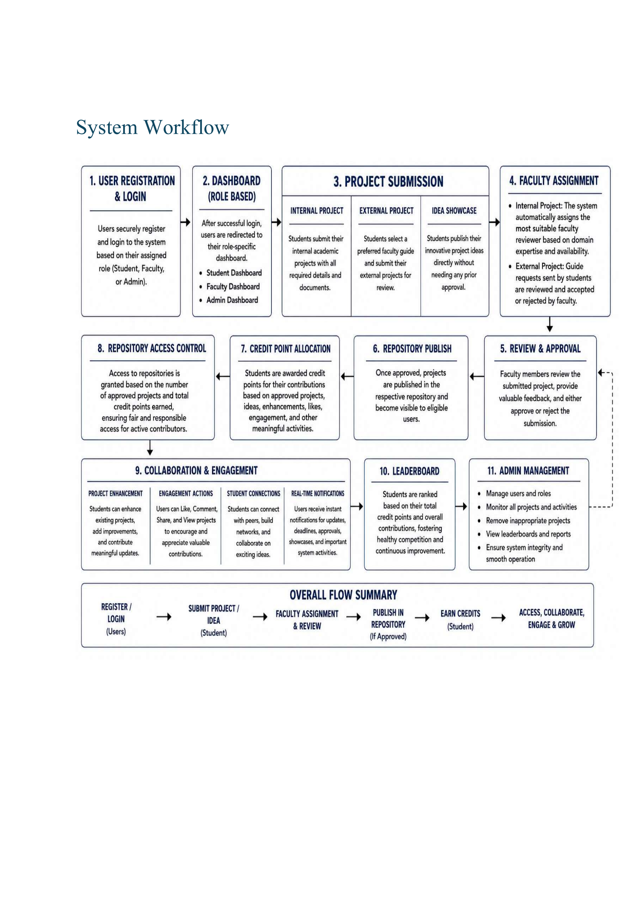
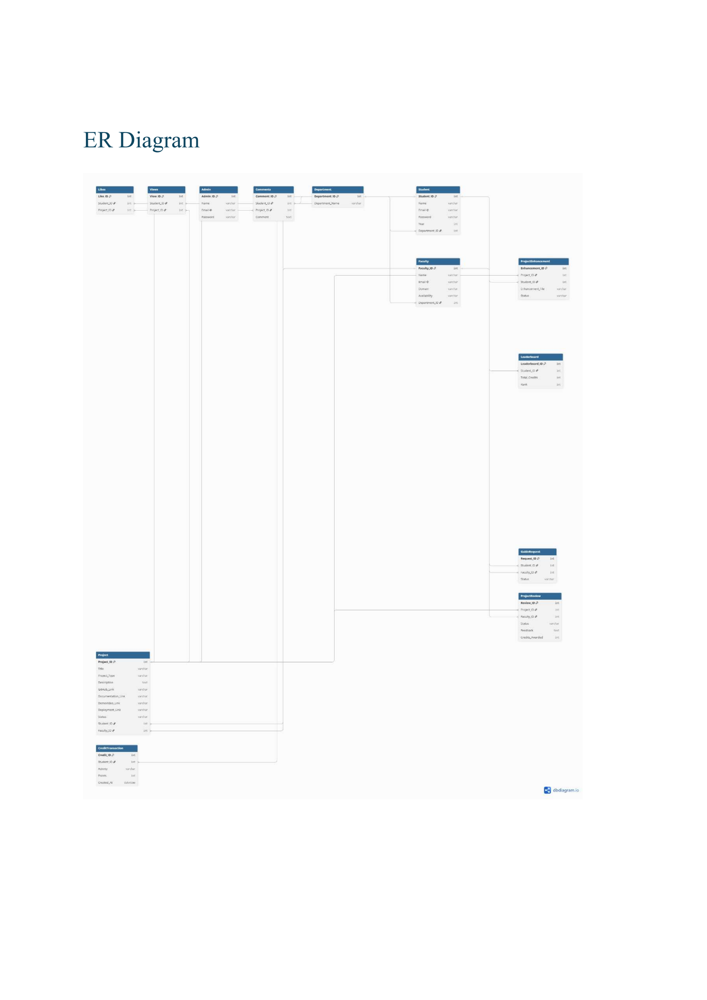
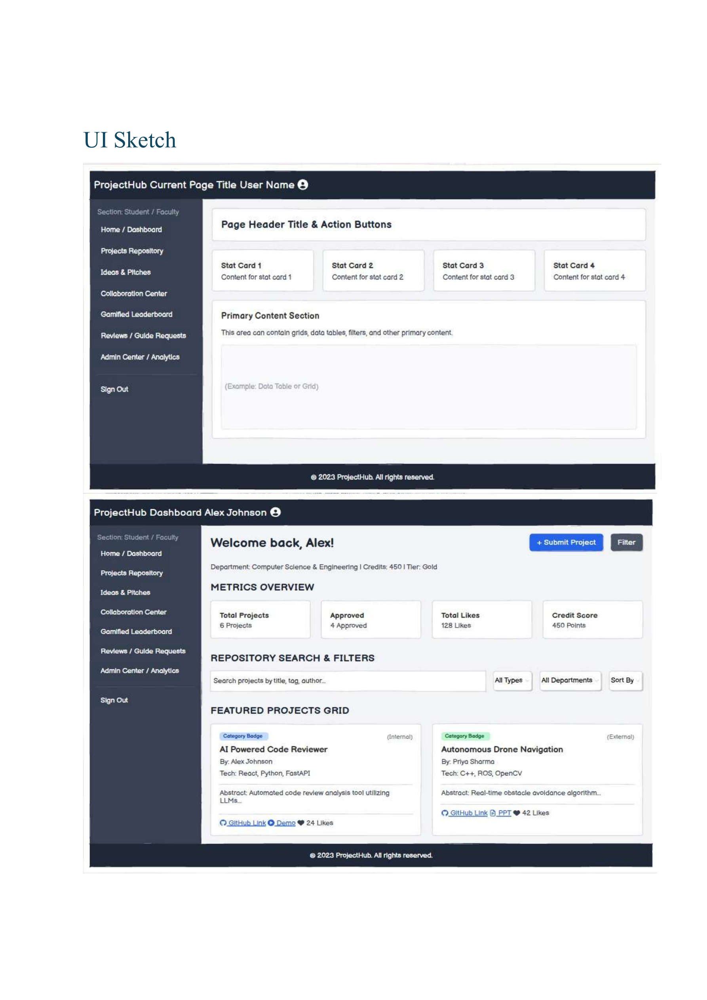
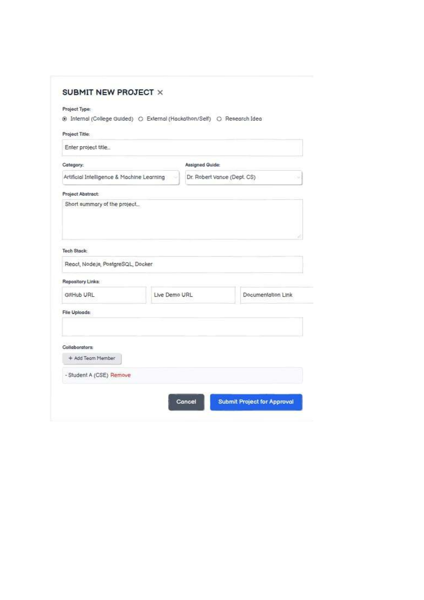
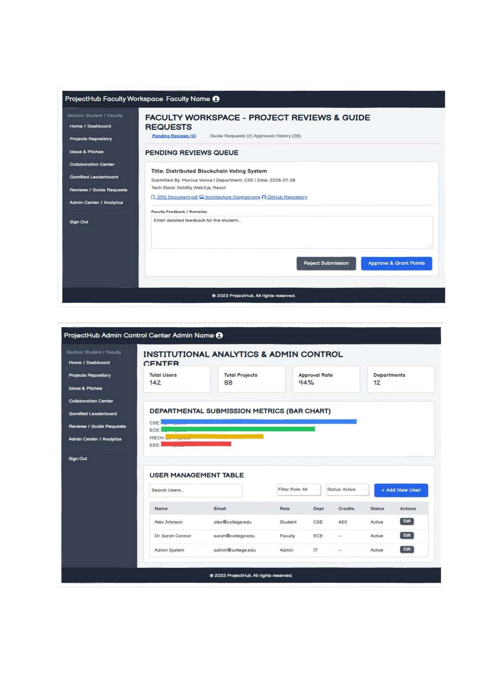

# TechNova Software Hackathon
## Team Name: Codexx

---

# SOFTWARE REQUIREMENTS SPECIFICATION (SRS)
### Student Project Repository and Showcase Platform

---

## 1. Problem Statement
Many educational institutions still rely on manual methods or disconnected systems to manage student projects, making project submission, approval, storage, and retrieval inefficient. Students often face difficulties in showcasing their work, collaborating with peers, and accessing quality project resources. Faculty members spend significant time managing project reviews manually, while valuable student projects remain underutilized after completion. Additionally, the absence of a structured recognition system reduces student motivation to contribute innovative ideas. Therefore, there is a need for a centralized, secure, and collaborative platform that efficiently manages projects while encouraging knowledge sharing, innovation, and active student participation.

---

## 2. Existing System
In many educational institutions, student project management is carried out through manual processes or fragmented digital systems. Project submissions, faculty reviews, approvals, and document storage are often managed using emails, spreadsheets, or physical records, making the process time-consuming and difficult to track. There is no centralized repository for preserving previous projects, limited opportunities for collaboration and knowledge sharing, and no structured mechanism to recognize student contributions, resulting in reduced transparency, accessibility, and overall efficiency.

---

## 3. Proposed Solution
The proposed **Student Project Repository and Showcase Platform** provides a centralized web-based solution for managing Internal Projects, External Projects, and Project Ideas. The platform automates project submission, domain-specific faculty assignment with workload capacity thresholds, review, approval, and repository management, reducing manual effort and improving transparency. It introduces a Credit Point System, student networking, leaderboards, notifications, and project collaboration features to encourage continuous participation and knowledge sharing. Repository access is based on student contribution credit tiers, ensuring responsible use of academic resources.

---

## 4. Objectives
- To digitize the complete project submission, review, approval, and repository management process.
- To provide a centralized platform for storing, organizing, and showcasing Internal Projects, External Projects, and Project Ideas.
- To reduce manual paperwork and improve the efficiency of project management within the institution.
- To automatically assign faculty reviewers for internal projects based on project domain expertise and faculty availability/workload thresholds.
- To enable students to select faculty guides for external projects according to their project domain or department.
- To encourage creativity and innovation by providing an Idea Showcase platform for students to present their project concepts.
- To motivate students through a structured Credit Point System that rewards quality projects, innovative ideas, and collaborative contributions.
- To implement a secure repository access mechanism based on approved projects and earned credit points.
- To promote collaborative learning by allowing students to enhance and contribute to existing projects.
- To facilitate academic networking by enabling students to connect with peers and receive updates on their activities.
- To provide real-time notifications for project approvals, showcased projects, connection requests, and project submission deadlines.
- To increase student engagement through project likes, comments, views, leaderboards, and achievement recognition.
- To ensure transparency, fairness, and accountability in the faculty review and project approval process.

---

## 5. System Scope
The platform supports 14 integrated modules:
1. Student Registration & User Authentication
2. Student Profile & Credit Audit Log Management
3. Internal Academic Project Management
4. External Project & Guide Management
5. Idea Showcase Module
6. Workload-Aware Faculty Assignment & Guide Management
7. Credit Point Management System
8. Project Collaboration & Peer Enhancement
9. Tiered Repository Access Control
10. Project Repository & Multi-Criteria Search/Filtering
11. Student Gamified Leaderboard
12. Project Engagement Module (Likes, Views, Comments)
13. Real-Time System Notifications
14. Governance & Admin Management Center

---

## 6. Technology Stack & Requirements

### Technology Stack
| Component | Technology |
| :--- | :--- |
| **Frontend** | React.js (Vite), Vanilla CSS3 Design Tokens |
| **Backend** | Node.js, Express.js |
| **Database** | PostgreSQL (with in-memory fallback data store) |
| **Authentication** | JWT (JSON Web Tokens), Role-Based Access Control (RBAC) |
| **File Storage** | Multer File Engine (Local & Cloud Compatible) |
| **Version Control** | Git & GitHub |

### Software & Hardware Requirements
- **Operating System**: Windows 10/11, Linux, macOS
- **Browser**: Chrome, Edge, Firefox, Safari
- **Runtime & DB**: Node.js (v18+), PostgreSQL (v14+)
- **Hardware**: Dual-Core Processor (Intel i5 or above), 8 GB RAM, 256 GB SSD

---

## 7. User Roles & Key Capabilities

### 🎓 Student Role
- Register / Login with role-based authentication.
- Upload Internal Academic Projects, External Showcase Projects, and Project Ideas.
- Request custom domain approvals if working on specialized emerging domains.
- Browse unlocked project repositories based on earned credit tiers.
- Enhance existing open projects and submit collaboration requests.
- Track credit history audit logs and view position on institutional leaderboards.

### 👩‍🏫 Faculty Role
- Review assigned Internal Projects matching domain specializations.
- Inspect project specifications (abstracts, tech stack, documentation, PPTs, videos, files) before review.
- Accept or decline External Project mentorship guide requests.
- Investigate assigned project content violation reports and enter mandatory investigation remarks.
- Award or deduct credits upon project approval, revision requests, or fake report dismissals.

### 🛡️ Administrator Role
- Institutional governance dashboard monitoring students, faculty, and project analytics.
- Manage user accounts (add student/faculty/admin, remove accounts).
- Verify custom domain requests and assign domain-eligible faculty.
- Oversee content moderation queues and adjust repository credit access tiers.

---

## 8. Functional Modules & Workflows

### Module 3: Internal Project Workflow
```text
Student Submits Internal Project
       ↓
System Identifies Project Domain
       ↓
Faculty Automatically Assigned (Domain Expertise + Workload Capacity Limit)
       ↓
Faculty Inspects & Reviews Submission
       ↓
Approved Project Published to Repository → Notifications Sent → Credits Updated (+10 to +25)
```

### Module 4: External Project Workflow
```text
Student Submits External Project & Selects Domain
       ↓
System Routes Guide Request to Domain Faculty
       ↓
Faculty Receives Notification & Inspects Proposal
       ↓
Faculty Accepts / Declines Mentorship
       ↓
Upon Approval, Published to External Repository & Credits Awarded (+20)
```

### Module 7 & 9: Credit Point Policy & Tiered Access Control
| Activity / Milestone | Credit Points |
| :--- | :--- |
| Internal Project Approved | +10 to +25 Credits |
| External Project Approved | +20 Credits |
| Verified Project Idea Published | +5 to +10 Credits |
| Successful Project Enhancement | +10 Credits |
| Every 10 Likes on Published Project | +1 Credit |
| Valid Content Violation Report | +5 Credits |
| Invalid / Fake Content Report Penalty | -5 Credits |

#### Access Tiers
- **< 60 Credits**: No Repository Access (Base Floor: Minimum 3 Approved Projects Required)
- **≥ 60 Credits**: View Idea Showcase Repository
- **≥ 100 Credits**: View Internal Academic Projects Repository
- **≥ 200 Credits**: View External Projects & Advanced Gold Repositories

---

## 9. Non-Functional Requirements
- **Performance**: Sub-3-second response time; handles concurrent user traffic smoothly.
- **Security**: JWT token-based session management, bcrypt password hashing, input sanitization, and confidential reviewer assignment (students cannot view assigned reviewer details).
- **Reliability**: Data integrity constraints, atomic operations, error fallback mechanisms.
- **Usability & Aesthetics**: Vibrant dark mode glassmorphism UI, responsive across desktop and mobile browsers.

---

## 10. Database Schema Overview
The relational schema comprises:
- `users`: Account profiles, roles, departments, academic years, credits, approved counts, skills.
- `departments`: Institutional academic departments.
- `projects`: Project details, domains, access types, status, URLs, tech stacks.
- `project_files`: Uploaded documentation, code archives, PDFs, DOCX files.
- `project_collaborators`: Peer collaboration links.
- `review_queue`: Pending faculty evaluation items.
- `guide_requests`: Mentorship requests for external projects.
- `domain_requests`: Custom domain verification queue.
- `reports`: Content violation moderation items with remarks.
- `credit_history`: Transparent credit transaction logs.

---

## 11. System Workflow Diagram


---

## 12. Entity-Relationship (ER) Diagram


---

## 13. UI Sketches & Interface Wireframes

### Platform Overview & Student Dashboard Wireframe


### Submit New Project Modal Wireframe


### Faculty & Admin Control Workspace Wireframe


---

## 14. PDF Documentation
- 📄 **Official SRS Documentation PDF**: [`docs/Student_Project_Repository_SRS_Documentation.pdf`](docs/Student_Project_Repository_SRS_Documentation.pdf)

